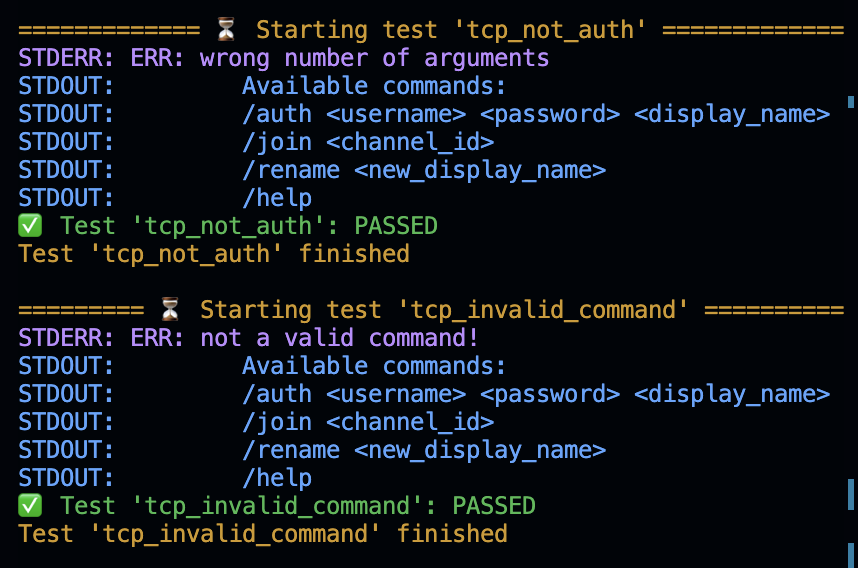

# IPK-01 Testing Server

Author: **Tomáš Hobza** ([xhobza03](mailto:xhobza03@vutbr.cz)) @ FIT VUT 2024

Co-Author IPK25: **Malashchuk Vladyslav** @ FIT VUT 2025

# Warning

I updated IPK24->IPK25 and passed all tests. But made it in 30 min, so it can have troubles.

I have : ✅ 55/55 test cases passed

# If you want to include test results in your IPK documentation made by tests from this repository. I advise you to include clearly indicate that you are not the author and leave a link to this git repository.

Example:

 ...
 
testy [4]

...

[4] MALASHCHUK Vladyslav, Tomáš HOBZA, et al. VUT_IPK_CLIENT_TESTS [online]. GitHub, 2025 [cit. 2025-04-16]. Available at: https://github.com/Vlad6422/VUT_IPK_CLIENT_TESTS

## 📚 Info

Testing server for testing the TCP/UDP messaging client for the IPK project 2025 written in Python. Feel free to use it and modify it however you want.

> ⚠️ I am not an expert in communications nor Python so go on with caution. Any problems that you might find you can hit me up (email/discord) or create a PR.

## 🔄 Usage

The specific usage can be listed with the `-h` flag, but here's probably the most important stuff:

- `<path_to_executable>` - provide the path to the client executable
- `-p <udp|tcp>` - choose the tested protocol (default is both)
- `-d` - will show both `stdout` and `stdin` of the running client
- `-t <testcase_name>` - run a specific test case only

## Run example (For lazy)
- `git clone https://github.com/Vlad6422/VUT_IPK_CLIENT_TESTS.git`
- `cd VUT_IPK_CLIENT_TESTS/`
- `pip3 install termcolor`
- `python3 testo.py ./ipk25chat-client` <- `ipk25chat-client` is your binary file in same directory with testo.py, or path to binary.

## 🛠️ Prerequisites

You might need to install `termcolor` if you don't have it yet using `pip3 install termcolor`.

## ⚖️ License

See [LICENSE](LICENSE).

